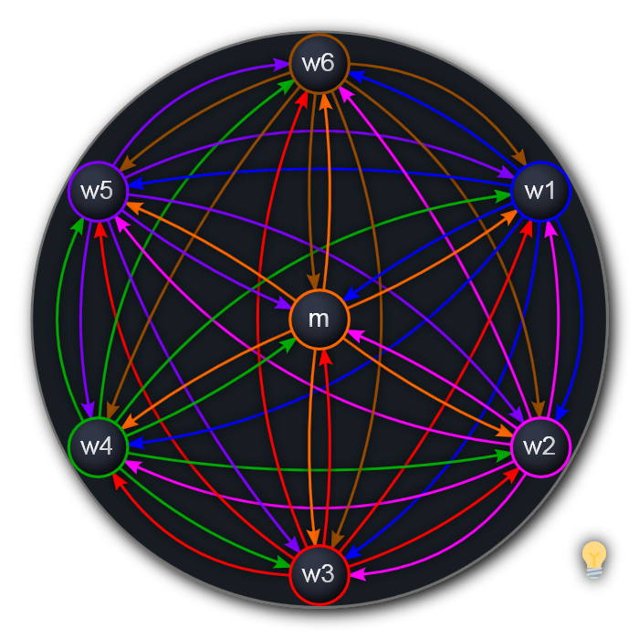
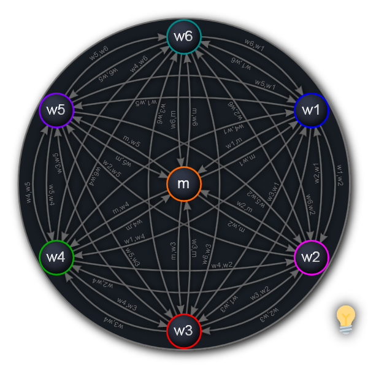
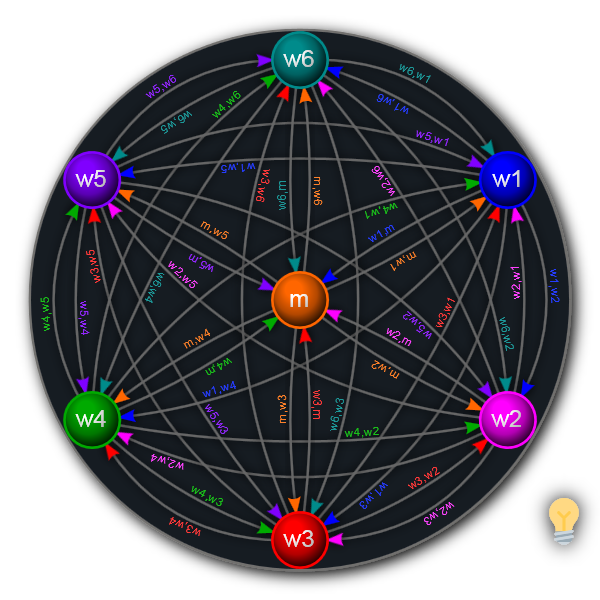

# @xamidi/interactive-svg-graphs ([repository](https://github.com/xamidi/interactive-svg-graphs))

The following images are interactive Scalable Vector Graphics (`.svg`) files that include animations and hyperlinks. I embedded these images via the HTML tag [`<object>`](https://www.w3schools.com/tags/tag_object.asp). **However**, interactive components do not work in GitHub Markdown, because [``](https://www.w3schools.com/tags/tag_img.asp) is insufficient and even local embeddings with tags such as `<object>`, [`<embed>`](https://www.w3schools.com/tags/tag_embed.asp) or [`<iframe>`](https://www.w3schools.com/tags/tag_iframe.asp) are currently unsupported by [GitHub Flavored Markdown](https://github.github.com/gfm/). But they should work on the [website](https://xamidi.github.io/interactive-svg-graphs/). In case you do not see vertices, edges *and* labels changing their colors when hovering components with your mouse cursor on the website, then your browser is outdated and doesn't support current [SVG](https://www.w3.org/TR/SVG2/) or [CSS](https://www.w3.org/TR/css-2023/) specifications.

All vector images shown below contain hyperlinks and use CSS to animate its elements based on user interaction. I created them with the intent to use them in `.md` ([Markdown](https://daringfireball.net/projects/markdown/)) files and discussions on GitHub, but then realized that no features are supported to actually embed them (meaning interactive elements do not operate there).

You can interact with the full variants on [GitHub Pages](https://xamidi.github.io/interactive-svg-graphs/) or by viewing them in their own browser tab.

Please submit your preferences to [my poll](https://github.com/xamidi/pmGenerator/discussions/8)! (Votes are anonymous.)

Hints to handle the animations <picture></picture>

- Move your mouse cursor over different elements to reveal or highlight all similar elements.
- The light bulb (💡) does this for everything at once.

### 1. Minimalistic variant [[Direct link](https://xamidi.github.io/interactive-svg-graphs/axioms-graph.svg)] [[Source code on GitHub](https://github.com/xamidi/interactive-svg-graphs/blob/master/axioms-graph.svg?short_path=18e7700&ts=4)]

<object data="axioms-graph.svg" type="image/svg+xml">
  
</object>

### 2. Fully labelled variant [[Direct link](https://xamidi.github.io/interactive-svg-graphs/axioms-graph-labels.svg)] [[Source code on GitHub](https://github.com/xamidi/interactive-svg-graphs/blob/master/axioms-graph-labels.svg?short_path=18e7700&ts=4)]

<object data="axioms-graph-labels.svg" type="image/svg+xml">
  
</object>

### 3. Colorful variant [[Direct link](https://xamidi.github.io/interactive-svg-graphs/axioms-graph-colored.svg)] [[Source code on GitHub](https://github.com/xamidi/interactive-svg-graphs/blob/master/axioms-graph-colored.svg?short_path=18e7700&ts=4)]

<object data="axioms-graph-colored.svg" type="image/svg+xml">
  
</object>

### What am I actually looking at?

These are [directed graphs](https://en.wikipedia.org/wiki/Graph_%28discrete_mathematics%29#Directed_graph), more specifically [7-vertex cliques](https://en.wikipedia.org/wiki/Clique_%28graph_theory%29) but with directed edges. The images are symmetric under 60° rotations (apart from labels and colors), and arranged as [regular hexagons](https://en.wikipedia.org/wiki/Hexagon).

Vertices are meant to represent the axioms of [all seven minimal 1-base proof systems](https://xamidi.github.io/pmGenerator/README.html#custom-proof-systems) for [classical propositional logic](https://plato.stanford.edu/entries/logic-propositional/) with only →,¬ (“implies” and “not”) as connectives. Edge labels are meant to be updated to the smallest known proof lengths of deriving one axiom from another, once I started a corresponding proof minimization challenge. I plan to do this after the [current challenge](https://github.com/xamidi/pmGenerator/discussions/2) (for completeness proofs in the same systems) reached a more mature state.

Such graphs could also be useful to illustrate [deterministic finite automata](https://en.wikipedia.org/wiki/Deterministic_finite_automaton), or similar.
